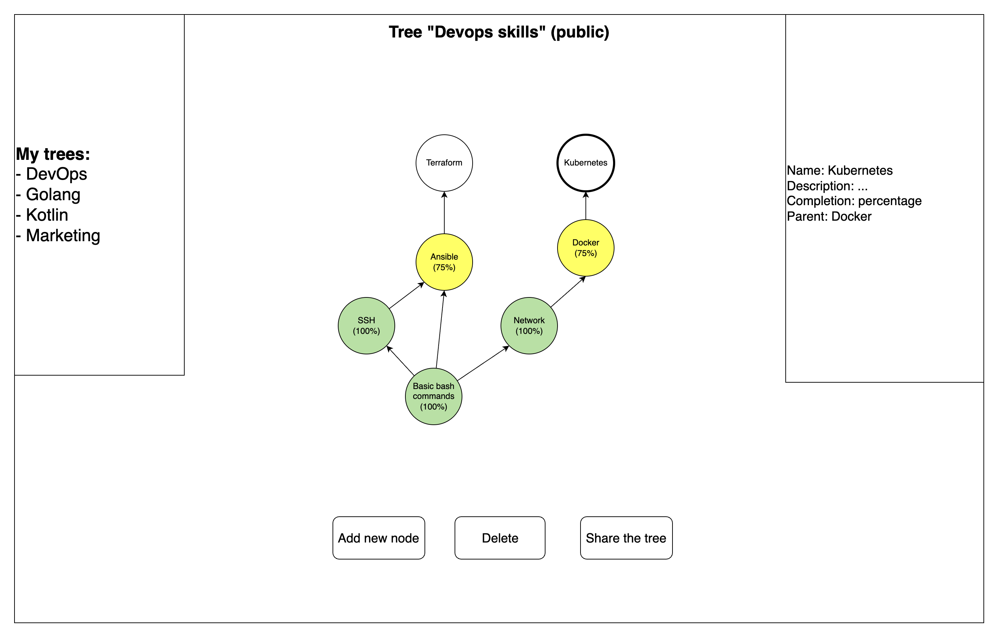

# yourownskilltree

Учебный проект курса [Kotlin Backend Developer](https://otus.ru/lessons/kotlin/).

YourOwnSkillTree - сервис для визуализации собственного дерева умений в игровой форме. 
Пользователь может создавать новые умения, привязывать их к существующим, отмечать прогресс по ним, а также делиться своим деревом с другими.
Преподаватель может создать свое дерево умений и отправить его студентам, чтобы они отмечали прогресс по нему, проходя различные тесты.

## Пример фронтенда

## Документация

1. [Маркетинг](./docs/marketing.md)
2. Аналитика
    1. [Функциональные требования](./docs/functional-requirements.md)
    2. [Нефункциональные требования](./docs/non-functional-requirements.md)
3. [DevOps](./docker-compose.yml)
4. Архитектура
    1. [Описание API](./docs/api.md)
    2. [Схема](./docs/arch.png)

## MVP

Так как в рамках учебного курса представляется затруднительным реализовать полный функционал сервиса,
на первом этапе будет разработан MVP, включающий в себя:

1. CRUD для сущности Skill (древовидная)
2. Авторизацию по заранее заданным токенам пользователей
3. Хранение данных в реляционной или графовой базе данных
